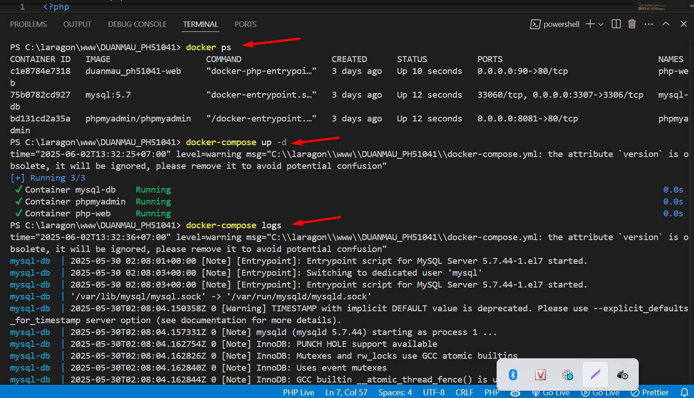
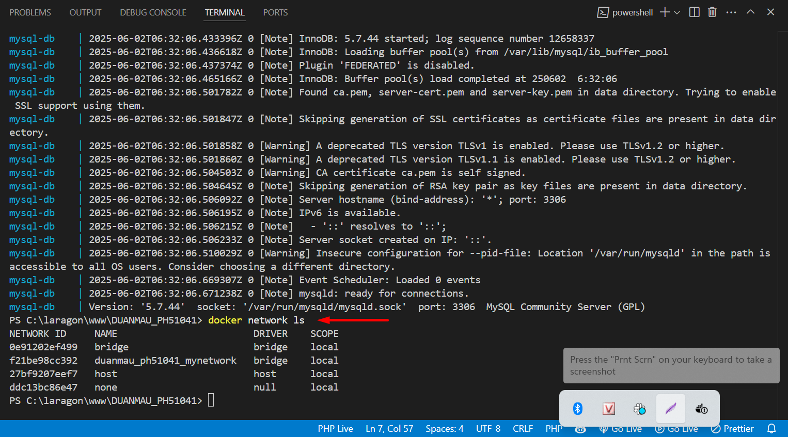
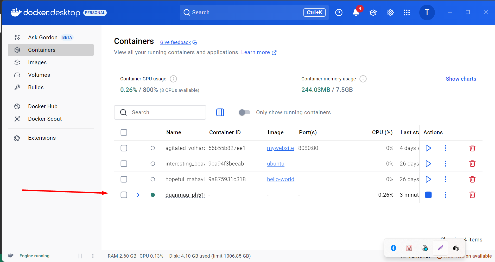

📅 Ngày: 02/06/2025
## 📘 Nội dung đã học:
Hôm nay tôi kiểm tra lại hệ thống Docker đã được thiết lập từ trước, đồng thời xử lý một số vấn đề cấu hình còn tồn đọng và tối ưu lại file docker-compose.yml. Tôi cũng ôn tập lại các thao tác cơ bản như khởi động lại container, kiểm tra log, port và mạng nội bộ của Docker.

🔧 Chi tiết công việc:
Khởi động lại hệ thống với các container PHP, MySQL và phpMyAdmin bằng docker-compose up -d.

Sử dụng docker ps và Docker Desktop để kiểm tra trạng thái hoạt động và port mapping.

Dùng docker-compose logs để theo dõi tiến trình khởi động và kết nối cơ sở dữ liệu.

Kiểm tra mạng nội bộ bằng docker network ls để xác nhận các container đang kết nối trong cùng network.

Gỡ dòng version: khỏi docker-compose.yml theo cảnh báo mới của Docker để tránh lỗi không cần thiết.

Xác minh lại phần ports để đảm bảo các dịch vụ được expose đúng qua localhost.

## 🔍 Khó khăn:
Ban đầu không thấy port hiển thị trên giao diện Docker Desktop do phần ports chưa rõ ràng trong YAML.

Cảnh báo version gây hiểu lầm, tưởng là lỗi nghiêm trọng.

## ✅ Giải pháp tìm ra:
Gỡ bỏ dòng version: trong file docker-compose.yml.

Cập nhật lại cấu hình ports để container hiển thị và truy cập được qua localhost.

Sử dụng các lệnh kiểm tra như docker ps, docker-compose logs, docker network ls để xác minh trạng thái hệ thống.

## 📝 Hình thức học:
Thực hành trực tiếp qua Docker Desktop và dòng lệnh PowerShell.

Đọc và áp dụng tài liệu chính thức từ Docker để sửa cấu hình cho đúng chuẩn.

## ✅ Kết quả & cảm nhận:
Hệ thống hoạt động ổn định sau khi được kiểm tra và tối ưu.

Hiểu rõ hơn về cách cấu hình Docker Compose, cách expose port và cách đọc log để debug.

Sẵn sàng triển khai các bước nâng cao tiếp theo như cấu hình Nginx hoặc tích hợp Laravel vào container PHP.

