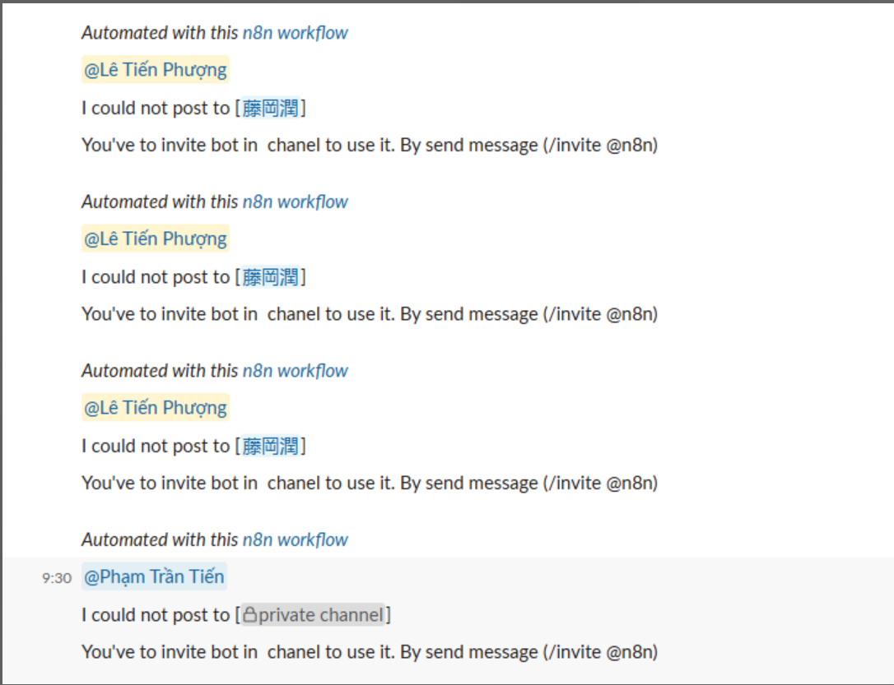
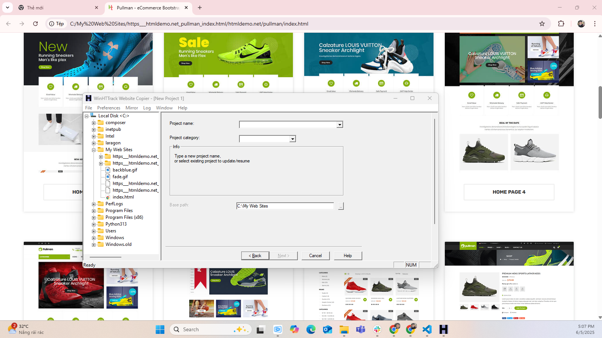

## 📅 Ngày: 05/06/2025
## 📘 Nội dung đã học:
Hôm nay tôi làm việc với n8n để cải tiến workflow xử lý Slack reactions, cụ thể là thay đổi đối tượng được mention trong thông báo từ người gửi tin nhắn sang người đã thả emoji. Đồng thời, tôi cũng tìm hiểu cách lấy template miễn phí .

## 🔧 Chi tiết công việc:
Cập nhật logic workflow trong n8n:

Trước đây, thông báo mention người gửi tin nhắn gốc khi có người phản hồi bằng emoji.

Giờ đây, tôi đã thay đổi thành mention người đã thả emoji (người trigger).

Áp dụng {{$json["user"]["username"]}} hoặc tương đương để lấy đúng người tương tác.

Tìm hiểu cách sử dụng templates miễn phí trên n8n:

Truy cập mục Templates trong n8n Editor.

Lọc các workflow theo tag hoặc chức năng (ví dụ: "Slack", "Translate").

Chọn và import các workflow mà không mất phí từ cộng đồng chia sẻ.

## 🔍 Khó khăn:
Ban đầu hiểu sai cấu trúc dữ liệu JSON trong Slack webhook nên lấy sai user.

Mất thời gian phân biệt user của message với user của emoji reaction.

Giao diện template hơi khó tìm kiếm nếu không dùng từ khóa phù hợp.

## ✅ Kết quả & cảm nhận:
Đã sửa đúng logic để phản hồi nhắm tới người thả emoji, giúp trải nghiệm Slack tốt hơn.

Biết cách truy cập và sử dụng các template miễn phí 

Cảm thấy tự tin hơn khi thao tác với JSON structure trong n8n và khi tuỳ biến automation.

