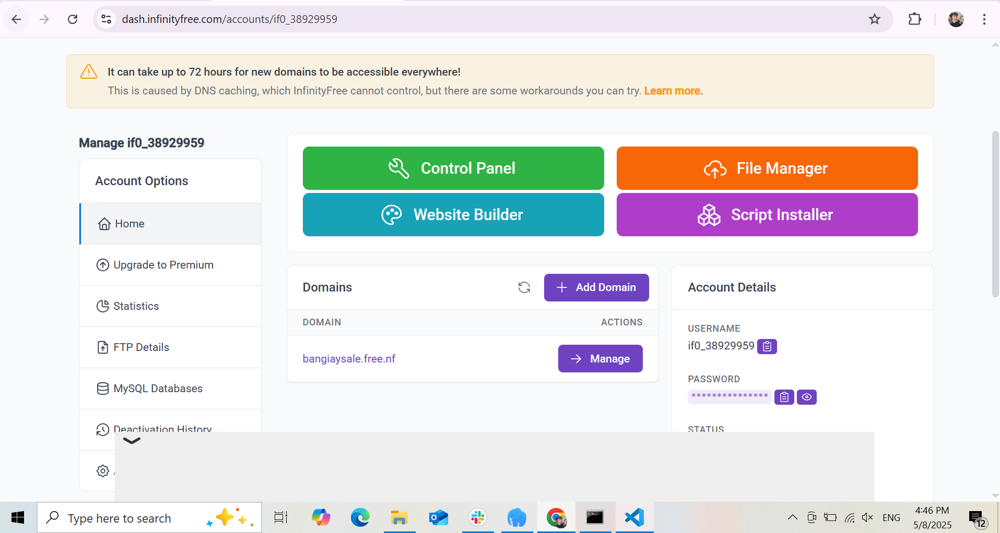

📅 Ngày: 08/05/2025
 ## 📘 Nội dung đã học:
Đẩy code lên website thông qua Git và các công cụ hỗ trợ.

Tạo hosting miễn phí và đưa mã nguồn lên hosting.

Đọc và nắm bắt các quy tắc commit trong Git để làm việc nhóm hiệu quả.

 ## 📖 Phương pháp học:
Thực hành trực tiếp bằng cách sử dụng Git để đẩy mã nguồn lên hosting miễn phí (ví dụ: Netlify, Vercel, hoặc GitHub Pages).

Tìm hiểu về các quy tắc commit qua tài liệu và hướng dẫn Git, như việc viết commit message rõ ràng, đầy đủ và tuân thủ các quy ước như "Commit message guidelines".

## ❗ Vấn đề gặp phải:
Lúc đầu gặp khó khăn khi cấu hình hosting và đưa mã nguồn lên, nhưng đã giải quyết được vấn đề bằng cách tham khảo tài liệu chi tiết.

## ✅ Kết quả & cảm nhận:
Đã hoàn thành việc đẩy mã lên hosting và hiểu các quy tắc commit để sử dụng Git hiệu quả hơn trong công việc nhóm.

