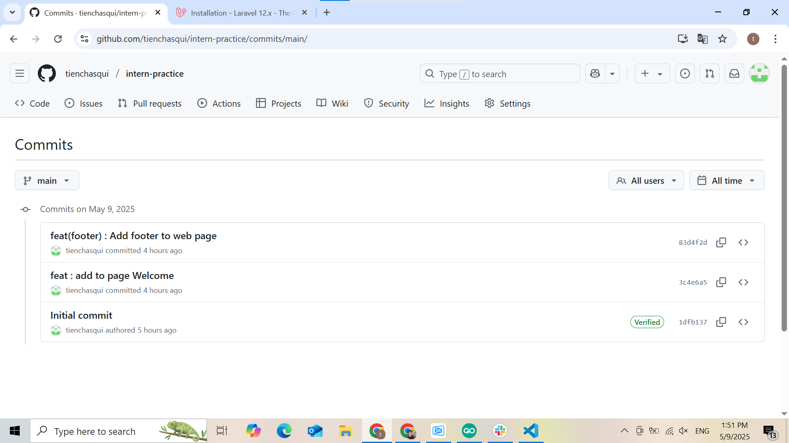

📅 Ngày: 09/05/2025

## 📘 Nội dung đã học:
Đặt tên commit chuẩn và thực hành với các nhánh (branch) trong Git.

Học về các khái niệm Remote Repository, Local Repository, Staging Area, và Git Repository.

## 📖 Phương pháp học:
Thực hành trực tiếp bằng cách tạo các nhánh mới, thực hiện commit với thông điệp chuẩn và đẩy các thay đổi lên kho lưu trữ từ xa (remote repository).

Tìm hiểu lý thuyết và thực hành qua tài liệu về các khái niệm trong Git như Remote Repository, Local Repository, Staging Area, và Git Reposito
## ❗ Vấn đề gặp phải:
Ban đầu, tôi gặp khó khăn trong việc quản lý các nhánh và đặt tên commit sao cho hợp lý. Tuy nhiên, sau khi đọc thêm tài liệu và thực hành nhiều lần, tôi đã hiểu rõ các nguyên tắc và quy tắc của việc sử dụng Git trong quản lý mã nguồn.

## ✅ Kết quả & cảm nhận:
Tôi đã thực hành được việc tạo và quản lý các nhánh trong Git, bao gồm việc đặt tên commit chuẩn và sử dụng các khái niệm Remote Repository, Local Repository, Staging Area, và Git Repository một cách hiệu quả. Các khái niệm này giúp tôi hiểu rõ hơn cách quản lý mã nguồn khi làm việc nhóm và trên các dự án lớn.

## Giải thích các khái niệm:
## Git Repository: Là nơi Git lưu trữ toàn bộ lịch sử và các thay đổi của mã nguồn trong dự án. Mỗi khi bạn commit, Git sẽ lưu lại thông tin về các thay đổi vào trong repository này.

## Local Repository: Là phiên bản Git Repository mà bạn có trên máy tính của mình. Bạn có thể làm việc offline và commit các thay đổi vào đây mà không cần kết nối internet.

## Remote Repository: Là kho lưu trữ mã nguồn trên các dịch vụ từ xa như GitHub, GitLab, hoặc Bitbucket. Đây là nơi để bạn chia sẻ mã nguồn với nhóm hoặc công ty, và thực hiện các thao tác như push (đẩy) hoặc pull (kéo) thay đổi giữa các máy tính khác nhau.

## Staging Area: Là khu vực tạm thời nơi bạn chuẩn bị các thay đổi để commit. Khi bạn sử dụng lệnh git add, các thay đổi được chuyển đến Staging Area, và khi commit, các thay đổi đó được lưu vào Local Repository.

