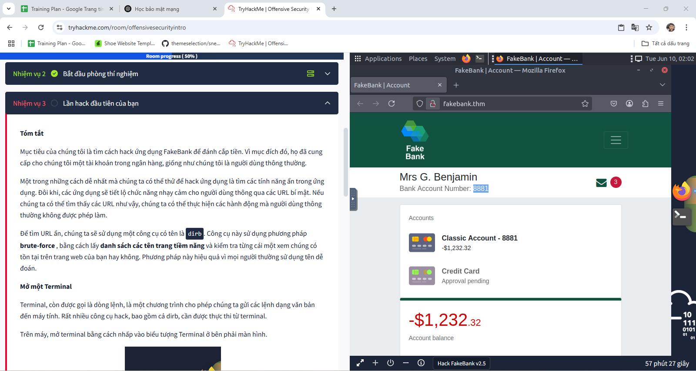

## 📅 Báo cáo công việc ngày 10/06/2025
Hôm nay, tôi đã tập trung vào việc học Cybersecurity trên nền tảng TryHackMe.

## 🛠️ Chi tiết công việc đã thực hiện:
Tôi đã dành thời gian để tìm hiểu về các kiến thức cơ bản và chuyên sâu trong lĩnh vực an ninh mạng thông qua các bài thực hành và phòng lab trên TryHackMe. Cụ thể, tôi đã tìm hiểu về:

Các mối đe dọa và lỗ hổng bảo mật phổ biến: Như phishing, malware, tấn công DDoS, SQL injection, XSS, v.v., thông qua các ví dụ thực tế trên TryHackMe.
Các nguyên tắc bảo mật cơ bản: Bao gồm tính bảo mật (Confidentiality), tính toàn vẹn (Integrity), và tính sẵn sàng (Availability) - mô hình CIA Triad.
Mật mã học: Các khái niệm về mã hóa, giải mã, thuật toán mã hóa đối xứng và bất đối xứng, có thể đã áp dụng trong các thử thách trên nền tảng.
Bảo mật mạng: Firewall, IDS/IPS, VPN, cách cấu hình mạng an toàn, thông qua việc tương tác với các môi trường mạng ảo.
Bảo mật ứng dụng và dữ liệu: Cách bảo vệ dữ liệu trên ứng dụng và cơ sở dữ liệu, có thể đã giải quyết các bài tập liên quan đến web application security.
Phòng thủ và ứng phó sự cố: Các bước cần thiết khi phát hiện sự cố an ninh mạng, có thể đã tham gia vào các phòng lab mô phỏng.
## ⚠️ Những khó khăn đã gặp phải:
Lượng kiến thức rộng lớn: Cybersecurity là một lĩnh vực rất rộng, việc hệ thống hóa kiến thức có thể mất thời gian, ngay cả khi học trên một nền tảng có cấu trúc.
Các khái niệm kỹ thuật phức tạp: Một số thuật ngữ và cơ chế bảo mật có thể khó hiểu ban đầu, đặc biệt khi áp dụng vào thực tế.
Thực hành: Mặc dù TryHackMe cung cấp nhiều bài thực hành, việc hiểu sâu và áp dụng linh hoạt các kỹ thuật đòi hỏi sự kiên trì và tìm tòi thêm.
## ✅ Kết quả đạt được:
Tôi đã có được những kiến thức nền tảng về Cybersecurity thông qua việc học lý thuyết kết hợp với thực hành trên TryHackMe.
Tôi đã nắm được các khái niệm cốt lõi và tầm quan trọng của an ninh mạng.
Việc học hôm nay trên TryHackMe là bước đầu quan trọng để tôi tiếp tục đi sâu vào lĩnh vực này và phát triển các kỹ năng thực tế.
