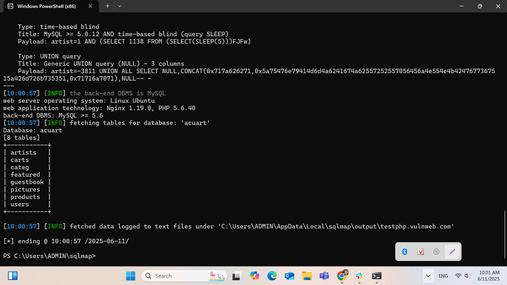
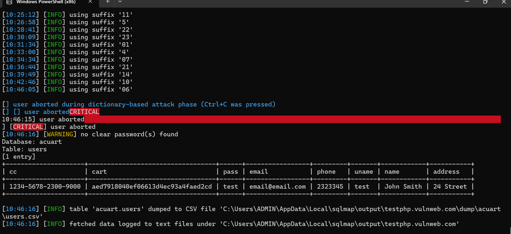

## 📅 Ngày: 11/06/2025
## 📘 Nội dung đã thực hiện:
Hôm nay tôi học về Types of attacks in programming (các kiểu tấn công trong lập trình), đặc biệt là SQL Injection, và thực hành khai thác lỗ hổng SQL trên một website thử nghiệm bằng công cụ SQLMap.

## 🔧 Chi tiết công việc:
Tìm hiểu các kiểu tấn công phổ biến trong lập trình như:
SQL Injection, XSS, CSRF, Command Injection, Buffer Overflow,...

Nghiên cứu sâu về SQL Injection:

Cơ chế hoạt động và cách kẻ tấn công chèn mã độc vào truy vấn SQL.

Các phương pháp khai thác SQLi:
Boolean-based, Time-based, Error-based, Union-based,...

Thực hành sử dụng SQLMap để:

Quét và phát hiện các cổng truy cập dễ bị tấn công trên website http://testphp.vulnweb.com/artists.php?artist=1.

Lấy danh sách các database, bảng, và cột từ database acuart.

Trích xuất thành công thông tin người dùng (users): email, password, cc,...

## ⚠️ Khó khăn gặp phải:
Việc phân tích output từ SQLMap cần kiên nhẫn do log khá dài.

Một số phương pháp như time-based mất nhiều thời gian kiểm tra.

Hiểu cú pháp SQLMap lúc đầu hơi khó, phải thử nhiều lần để ra đúng kết quả.

## ✅ Kết quả & đánh giá:
Đã hiểu được bản chất của SQL Injection và biết cách thực hiện kiểm tra bằng SQLMap.

Trích xuất thành công dữ liệu người dùng từ một hệ thống giả lập.

Sẵn sàng áp dụng kiến thức để hỗ trợ kiểm tra bảo mật sơ bộ cho ứng dụng thật.

