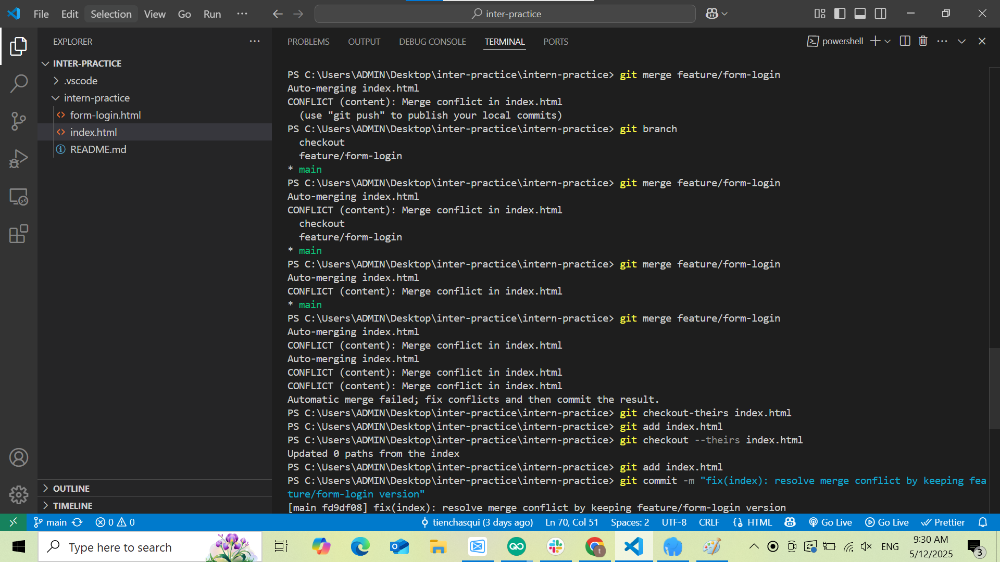
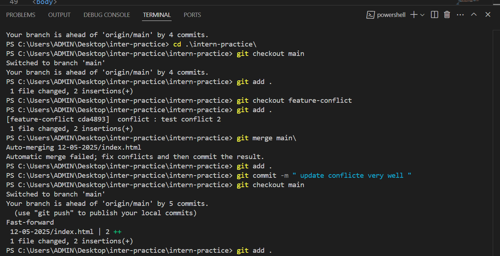
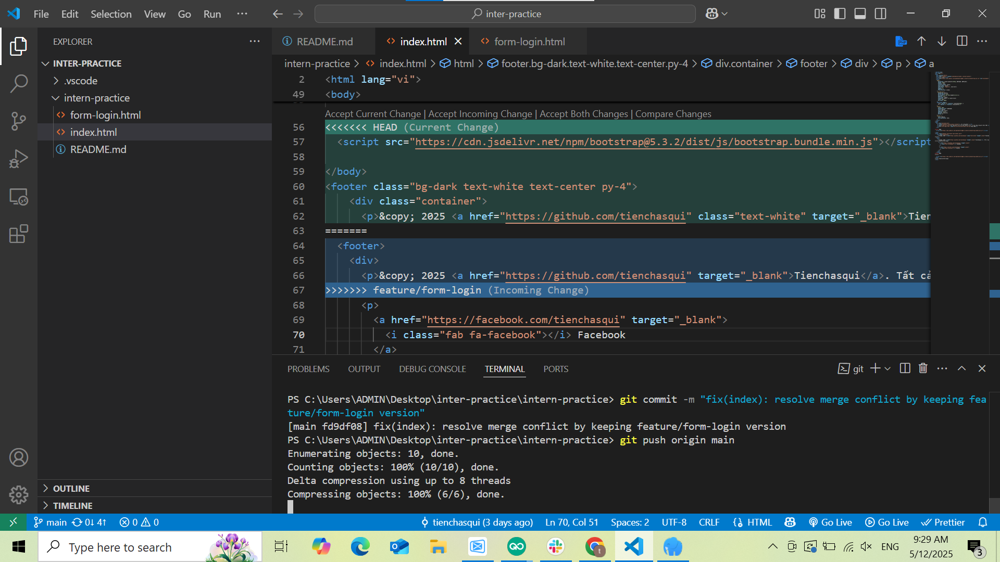

📅 Ngày: 12/05/2025

## 📘 Nội dung đã học:
Học về các lệnh git pull, git merge, và cách xử lý xung đột (conflict) cơ bản trong Git khi làm việc nhóm.

## 📖 Phương pháp học:
Đọc tài liệu và xem ví dụ minh họa về quá trình git pull, git merge.

Thực hành tạo nhánh, chỉnh sửa và thực hiện git merge trên cùng một máy.

Học lý thuyết cách hoạt động của git pull, do chưa có môi trường nhiều máy để thực hành thực tế.

Quan sát và xử lý xung đột bằng cách tạo thay đổi mâu thuẫn giữa các nhánh khác nhau trong một repository cục bộ.

## ❗ Vấn đề gặp phải:
Vì chỉ sử dụng một máy nên tôi chưa thể thực hành git pull từ remote repository trong môi trường làm việc nhóm. Tuy nhiên, tôi vẫn nắm được bản chất hoạt động của lệnh thông qua ví dụ và tài liệu. Khi merge, tôi cũng gặp vài xung đột và phải chỉnh sửa thủ công, điều này giúp tôi hiểu rõ hơn cách xử lý conflict.

## ✅ Kết quả & cảm nhận:
Tôi đã hiểu được nguyên lý hoạt động của git pull và git merge, cũng như quy trình xử lý conflict trong Git. Dù chưa thực hành được git pull trong môi trường thực tế, nhưng tôi tự tin rằng khi có thêm thiết bị hoặc làm việc nhóm, tôi có thể áp dụng hiệu quả. Việc xử lý conflict đã giúp tôi làm quen với tình huống thực tế khi làm việc trên các dự án chung.

## 🧠 Giải thích các khái niệm:
## 🔄 git pull:
Lệnh dùng để lấy và hợp nhất các thay đổi mới nhất từ remote repository về máy cục bộ. Thường được dùng khi làm việc nhóm. Vì chỉ dùng 1 máy nên tôi chưa thể thực hành lệnh này.

## 🔀 git merge:
Lệnh để hợp nhất hai nhánh với nhau. Nếu có thay đổi xung đột thì phải xử lý thủ công trước khi hoàn tất merge.

## ⚔️ Conflict (Xung đột):
Xảy ra khi Git không biết chọn phần thay đổi nào trong file bị chỉnh sửa bởi hai nhánh khác nhau. Cần xử lý bằng cách đọc, chỉnh sửa file rồi add và commit lại.

