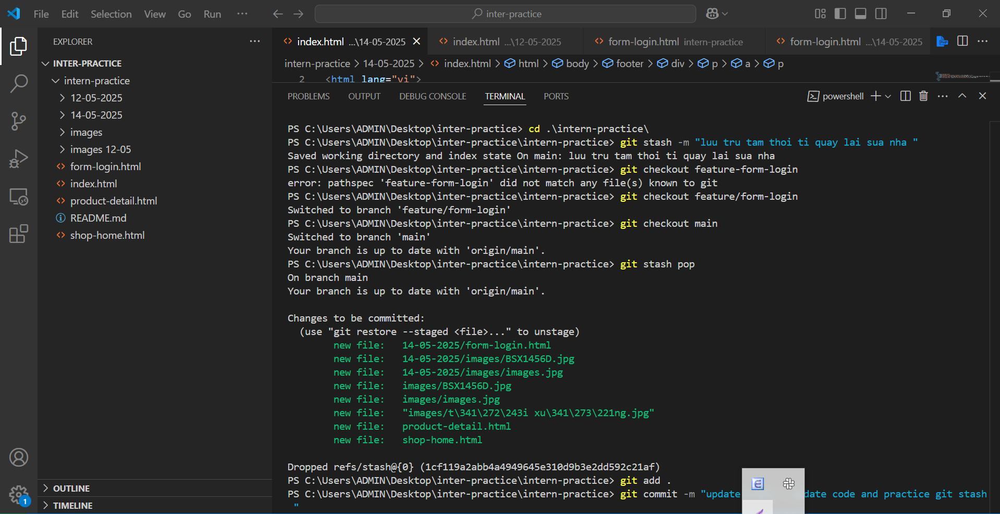
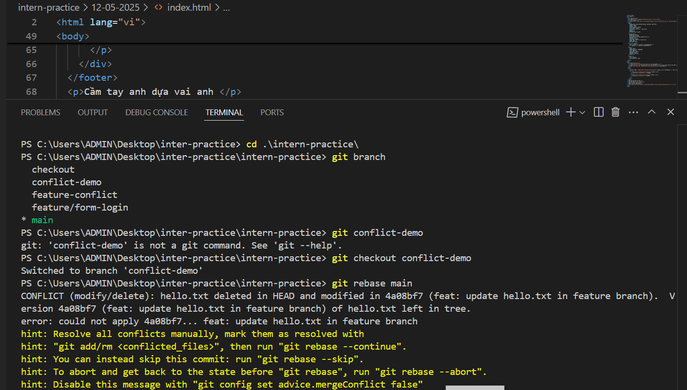

📅 Ngày: 14/05/2025

## 📘 Nội dung đã học:
Học về lệnh git stash để lưu tạm thay đổi cục bộ chưa commit, và lệnh git rebase để hợp nhất nhánh bằng cách viết lại lịch sử commit, giúp lịch sử gọn gàng hơn so với git merge.

## 📖 Phương pháp học:
Đọc tài liệu chính thức và blog kỹ thuật giải thích sự khác biệt giữa git rebase và git merge.

Xem ví dụ minh họa bằng sơ đồ về cách hoạt động của rebase.

Thực hành tạo các commit nhỏ trên nhánh phụ và dùng git rebase để chuyển lên nhánh chính.

Sử dụng git stash để lưu lại các thay đổi dở dang, thử checkout sang nhánh khác và quay lại pop thay đổi.

## ✅ Kết quả & cảm nhận:
Hiểu rõ cách sử dụng git stash để tạm lưu và khôi phục thay đổi trong quá trình làm việc dang dở.

Nắm được cách hoạt động và ưu điểm của git rebase, biết cách sử dụng để giữ lịch sử commit sạch sẽ và tuyến tính.

Việc thực hành nhiều tình huống khác nhau giúp tôi tự tin hơn khi áp dụng vào dự án thực tế.

## 🧠 Giải thích các khái niệm:
📥 git stash:
Lệnh giúp lưu tạm thời các thay đổi chưa commit, để có thể chuyển sang nhánh khác mà không mất công việc đang làm. Sau đó có thể dùng git stash pop hoặc git stash apply để khôi phục lại.

🔁 git rebase:
Lệnh dùng để "di chuyển" hoặc tích hợp các commit từ nhánh này lên một nhánh khác bằng cách viết lại lịch sử commit. Giúp lịch sử git sạch sẽ, tuyến tính hơn so với merge. Rất hữu ích khi cần giữ lịch sử rõ ràng và dễ theo dõi.

