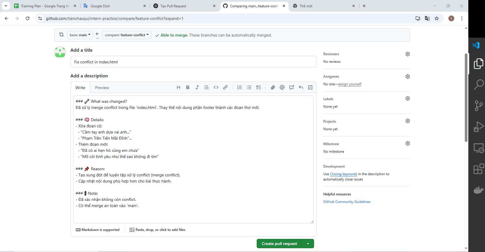
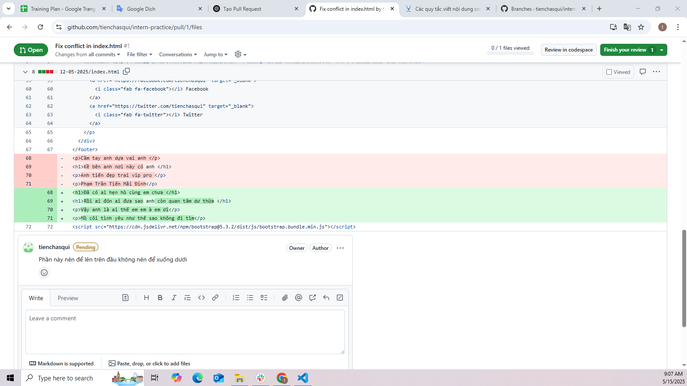
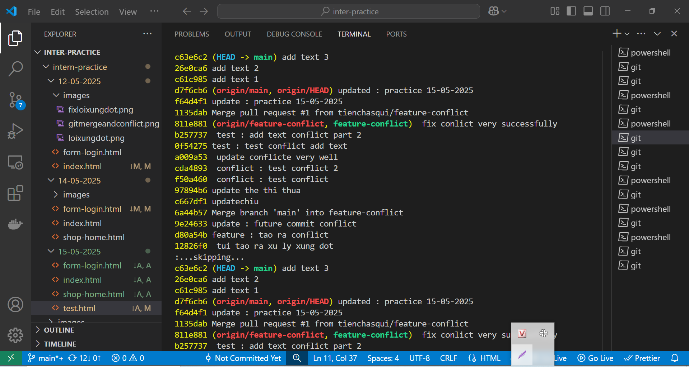
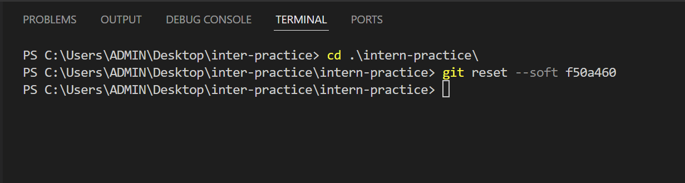
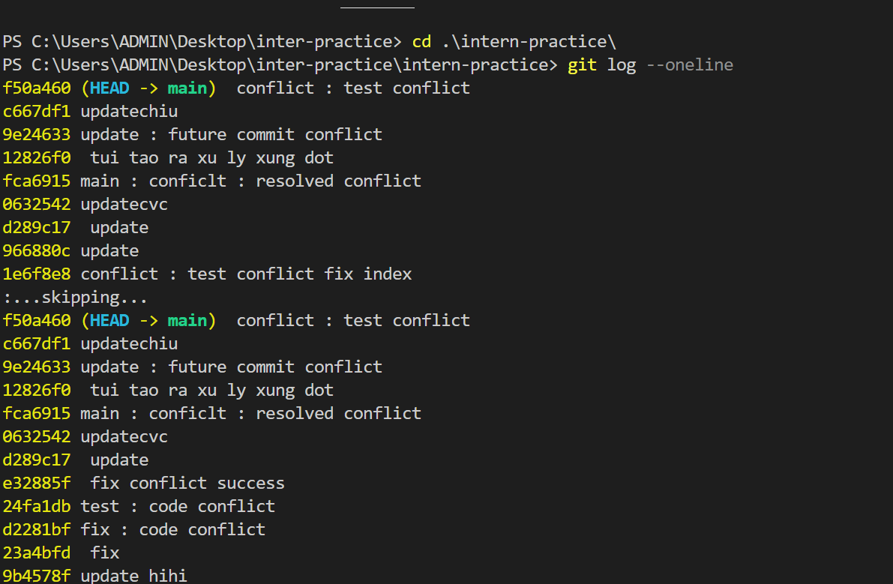
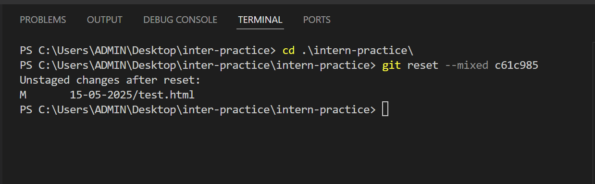
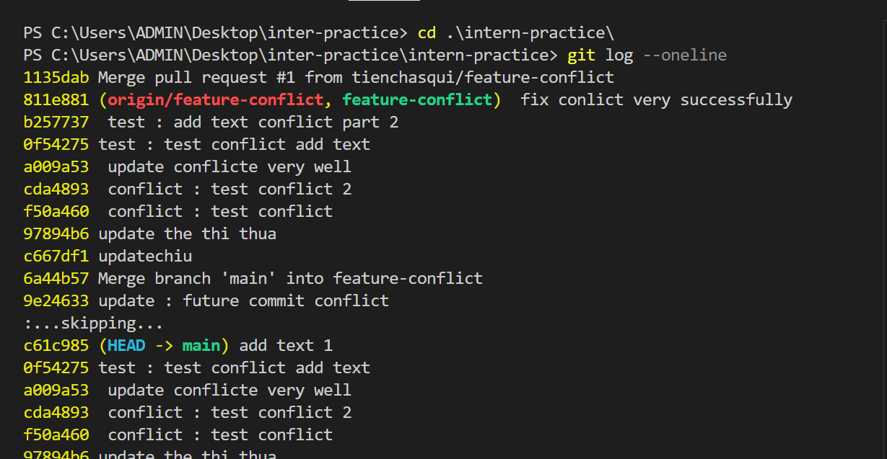
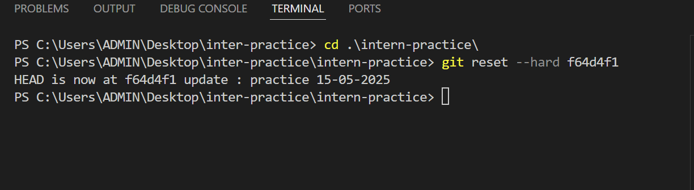
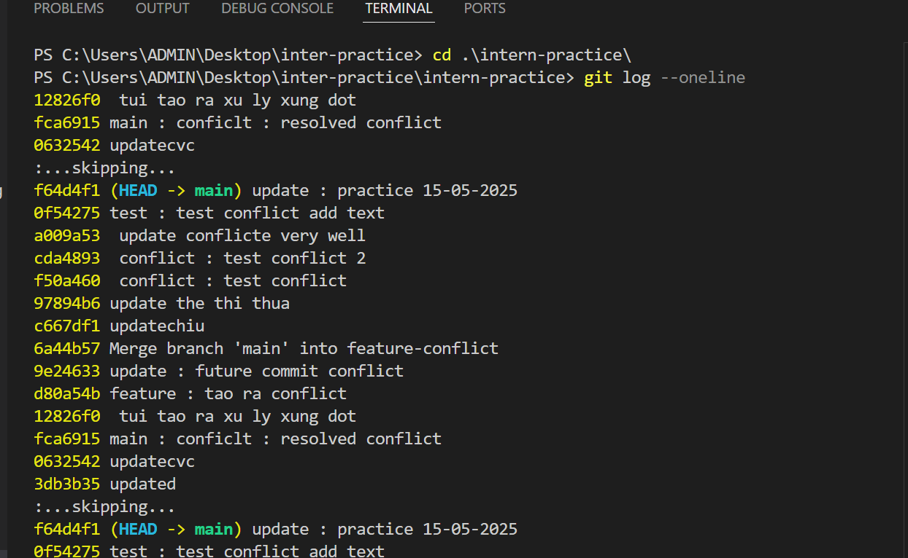
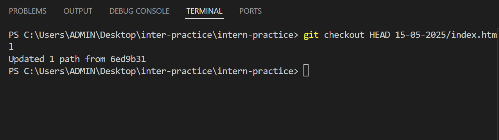

📅 Ngày: 15/05/2025

## 📘 Nội dung đã học:
Học về pull request và code review - quy trình gửi yêu cầu hợp nhất mã và kiểm tra, góp ý thay đổi từ các thành viên trong nhóm.
Tìm hiểu lệnh git reset và git checkout để thao tác với các commit và nhánh trong git.

## 📖 Phương pháp học:
Đọc tài liệu chính thức và các bài blog hướng dẫn chi tiết về pull request và review trong quy trình làm việc git.

Thực hành tạo pull request trên GitHub, thực hiện review và phản hồi comment từ người khác.

Đọc tài liệu về git reset với 3 chế độ: soft, mixed, hard.

Thực hành dùng git checkout để chuyển nhánh, phục hồi file, kết hợp với git reset để hiểu rõ sự khác biệt.

Nhận sự hướng dẫn trực tiếp từ mentor giúp giải thích rõ các chế độ của git reset.

## ❗ Vấn đề gặp phải:
Ban đầu, tôi gặp khó khăn khi đọc tài liệu về git reset vì không hiểu rõ sự khác biệt giữa các chế độ soft, mixed và hard. Phải đợi mentor giải thích mới nắm được bản chất và cách sử dụng.

## ✅ Kết quả & cảm nhận:
Hiểu rõ quy trình pull request và review, biết cách tạo PR, kiểm tra code người khác, và phản hồi góp ý hiệu quả.

Sau khi được mentor giải thích, tôi đã nắm được cách sử dụng git reset và git checkout linh hoạt trong quản lý lịch sử commit và các thay đổi file.

## 🧠 Giải thích các khái niệm:
🔀 Pull Request & Review:
Là quá trình gửi yêu cầu hợp nhất thay đổi (pull request) từ một nhánh vào nhánh chính và được các thành viên trong nhóm kiểm tra (review), góp ý để đảm bảo chất lượng code trước khi merge.

⏪ git reset:

--soft: Di chuyển HEAD tới commit khác, giữ nguyên thay đổi trong staging area và working directory.

--mixed (mặc định): Di chuyển HEAD, xóa thay đổi khỏi staging area nhưng vẫn giữ trong working directory.

--hard: Di chuyển HEAD và xóa tất cả thay đổi trong staging area và working directory, về trạng thái commit được reset.

🔄 git checkout:
Dùng để chuyển đổi giữa các nhánh hoặc phục hồi file/thư mục trong working directory về trạng thái commit cụ thể.

