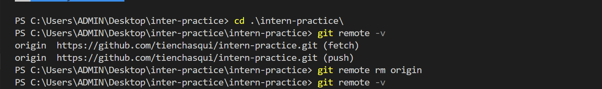
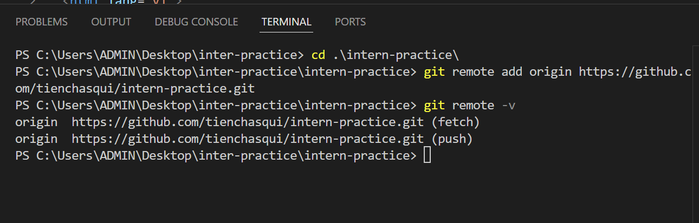
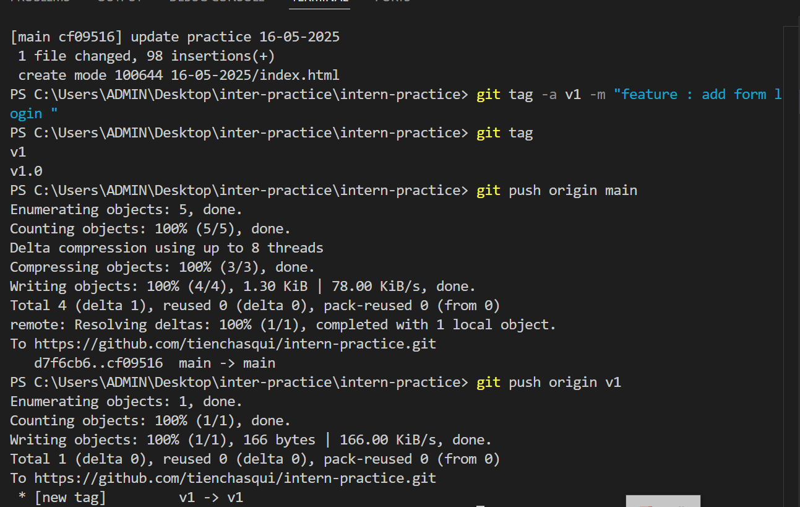

📅 Ngày: 16/05/2025

## 📘 Nội dung đã học:
Hôm nay tôi đã học về cách sử dụng git remote để kết nối giữa repository cục bộ và repository trên GitHub, cũng như hiểu rõ khái niệm và cách sử dụng git tag để đánh dấu các phiên bản trong dự án.

## 📖 Phương pháp học:
Đọc tài liệu và tìm hiểu lý thuyết về git remote và git tag.

Thực hành thao tác kết nối remote repository bằng các lệnh như git remote add, git remote -v, git push, git pull.

Thực hành gán tag cho các commit bằng git tag và tạo release tag trực tiếp trên GitHub.

Quan sát giao diện tạo release và tìm hiểu ý nghĩa của tagging, semantic versioning.

## ❗ Vấn đề gặp phải:
Lúc đầu chưa rõ việc tạo tag trên GitHub có liên quan đến việc merge code không. Sau khi tìm hiểu thì biết được rằng tag không thực hiện merge, nó chỉ đánh dấu một commit cụ thể.

## ✅ Kết quả & cảm nhận:
Tôi đã hiểu rõ cách Git quản lý kết nối giữa local và remote repository.

Biết được cách đánh dấu các phiên bản phần mềm bằng tag để dễ dàng quay lại hoặc phát hành release chính thức.

Cảm thấy tự tin hơn khi làm việc với remote repository và quản lý phiên bản trong Git.

## 🧠 Giải thích các khái niệm:
🌐 git remote:
Lệnh này dùng để thiết lập kết nối giữa repository cục bộ và repository trên GitHub (hoặc các dịch vụ khác). Thông qua kết nối này, ta có thể push, pull, hoặc fetch dữ liệu. Ví dụ:

🔖 git tag:
Dùng để đánh dấu một commit cụ thể, thường là các phiên bản phần mềm đã ổn định như v1.0, v2.0. Có hai loại:

Lightweight tag: chỉ đơn giản là tên gán cho commit.

Annotated tag: chứa thêm thông tin như người tạo, thời gian, ghi chú.

