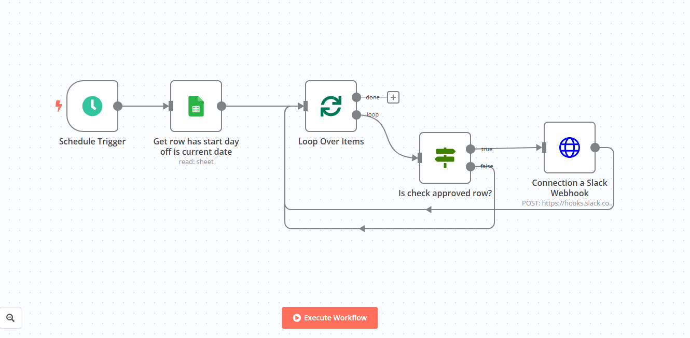
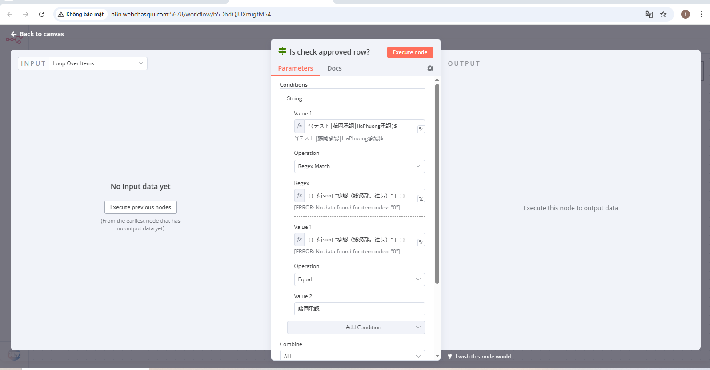
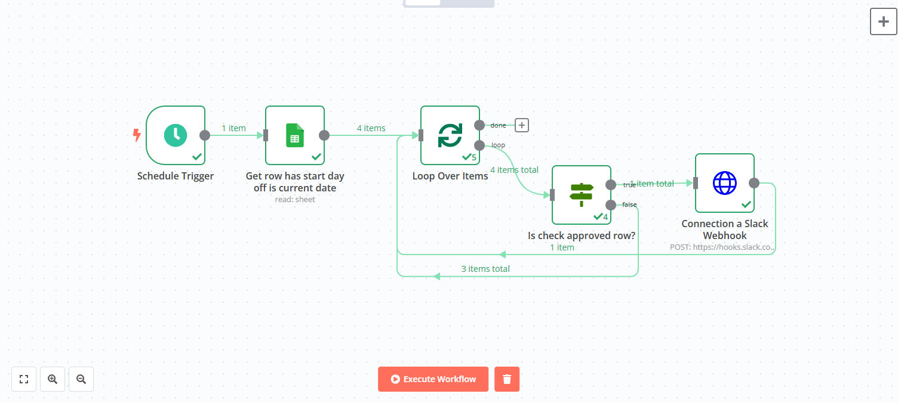

# 📅 Ngày: 19/05/2025

## 📘 Nội dung đã thực hiện:
Hôm nay tôi đã làm việc với **workflow trong nền tảng tự động hóa n8n** để thiết kế và triển khai **chương trình xử lý yêu cầu xin nghỉ phép**.

Mục tiêu của workflow:
- Cho phép nhân viên gửi yêu cầu xin nghỉ phép thông qua một form hoặc trigger cụ thể.
- Gửi yêu cầu đó đến người quản lý (sếp) để phê duyệt.
- Tùy theo quyết định của sếp:
  - ✅ **Nếu đồng ý** → gửi thông báo xác nhận đến **kênh Slack**.
  - ❌ **Nếu không đồng ý** → **không gửi** thông báo vào Slack.

---

## 🔧 Chi tiết kỹ thuật:
- **Công cụ sử dụng:** [n8n](https://n8n.io)
- **Các node chính trong workflow:**
  - `Webhook` / `Form trigger`
  - `Set` & `IF`
  - `HTTP Request`
  - `Slack (post message)`

### 👉 Luồng xử lý:
1. Nhân viên gửi yêu cầu
2. Gửi dữ liệu đến sếp
3. Sếp chọn **"Đồng ý"** hoặc **"Từ chối"**
4. Nếu "Đồng ý" → gửi thông báo Slack ✅
5. Nếu "Từ chối" → không gửi thông báo ❌

---

## ❗ Vấn đề gặp phải:
- Lỗi điều kiện `IF node` do sai định dạng dữ liệu phản hồi
- Slack Webhook ban đầu chưa gửi đúng JSON payload
- Do link google sheet bằng tiếng Nhật nên còn không hiểu
- Logic phải kiểm tra kỹ để không gửi nhầm nội dung rỗng

---

## ✅ Kết quả & cảm nhận:
- Đã triển khai thành công workflow xử lý xin nghỉ có điều kiện
- Tự động gửi thông báo Slack khi được phê duyệt
- Workflow n8n dễ dùng, rất trực quan, tích hợp tốt với hệ thống khác như Slack, Gmail, Google Sheets...

