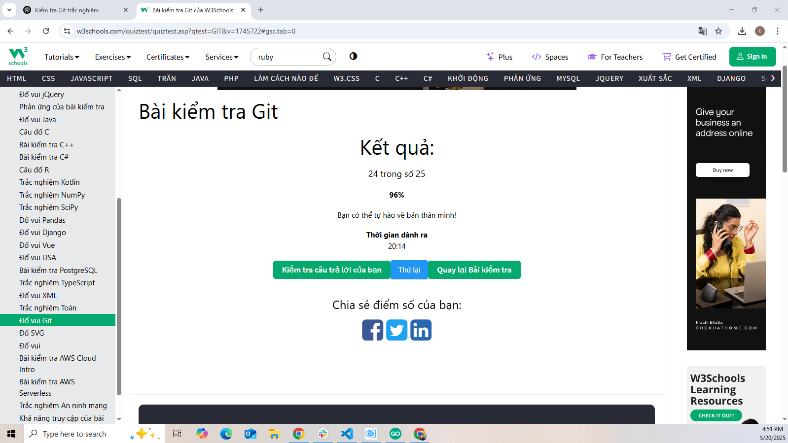
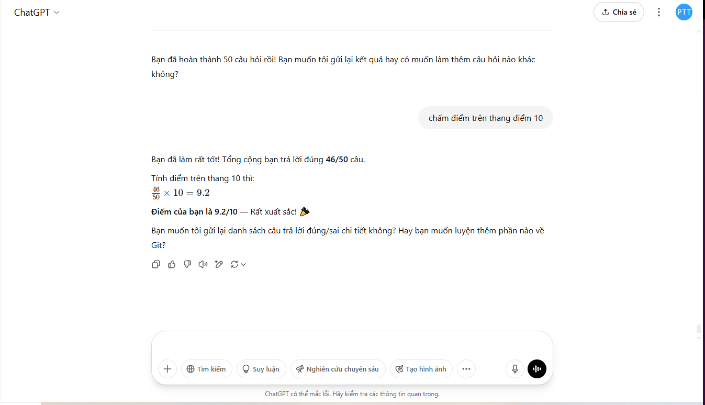

## 📅 Ngày: 20/05/2025
## 📘 Nội dung đã học:
Hôm nay tôi đã ôn tập lại toàn bộ kiến thức về Git thông qua hình thức trắc nghiệm và thực hành. Cụ thể:

Ôn lại các lệnh cơ bản và nâng cao như git init, git add, git commit, git push, git fetch, git revert, git reset, git branch, git merge, git tag, v.v.

Hiểu rõ quy trình làm việc với Git từ khởi tạo repository, staging, commit, đến thao tác với remote repository.

Tìm hiểu sự khác nhau giữa các lệnh như git pull vs git fetch, git reset vs git revert, git checkout vs git switch,...

## 📝 Hình thức ôn tập:
## Sử dụng ChatGPT để làm bài kiểm tra trắc nghiệm gồm 50 câu hỏi:

Hỏi – đáp từng câu một, được giải thích chi tiết đúng/sai sau mỗi câu.

Trải nghiệm học chủ động và phản hồi tức thì.

Được đánh giá và chấm điểm trên thang điểm 10.

## Làm bài kiểm tra Git trên W3Schools:

Thực hiện trực tuyến 25 câu hỏi trắc nghiệm.

Kết quả: 24/25 câu đúng – đạt 96%.

Tổng thời gian làm bài: 20 phút 14 giây.

## ✅ Kết quả & cảm nhận:
Tổng kết trên ChatGPT: Trả lời đúng 46/50 câu, đạt 9.2/10 điểm – Rất xuất sắc 🎉.

Trên W3Schools: 96% đúng – Rất tốt, chỉ sai duy nhất 1 câu.

👉 Tôi cảm thấy tự tin hơn rất nhiều khi sử dụng Git trong các dự án thực tế, nhất là trong teamwork và xử lý xung đột.

