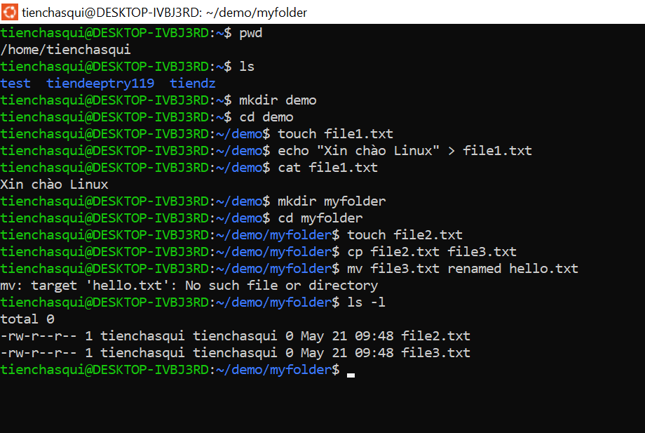

📅 Ngày: 21/05/2025
## 📘 Nội dung đã học:
Hôm nay tôi đã bắt đầu làm quen với hệ điều hành Linux thông qua Terminal. Tôi đã học và thực hành các kiến thức sau:

Hiểu được Terminal là gì và cách sử dụng nó để làm việc với hệ thống.

Nắm được cấu trúc cơ bản của một lệnh trong Linux: command [options] [arguments].

Thực hành một số lệnh cơ bản như:

pwd, ls, cd, mkdir, touch, rm, rmdir, clear, man.

Biết cách tạo thư mục, di chuyển giữa các thư mục, tạo và xóa file.

Làm quen với khái niệm hệ thống tập tin dạng cây trong Linux bắt đầu từ /.

Hiểu sự khác biệt giữa đường dẫn tuyệt đối và đường dẫn tương đối.

Nhớ các thư mục quan trọng như: /home, /etc, /usr, /var, /tmp, /bin,...

Thực hành thao tác với file:

Sao chép file (cp), di chuyển và đổi tên file (mv), xóa file/thư mục (rm, rm -r).

Xem thông tin chi tiết của file bằng ls -l, file, stat.

Ghi nội dung vào file bằng các cách:

echo "nội dung" > file.txt

echo "nội dung mới" >> file.txt

nano file.txt

cat > file.txt

Hiển thị nội dung file bằng cat.

## 📝 Hình thức học tập:
Học thông qua hỏi đáp trực tiếp với ChatGPT, vừa học vừa thực hành.

Mỗi lệnh được giải thích chi tiết, dễ hiểu, có ví dụ và hướng dẫn gõ từng bước.

Ghi chép lại toàn bộ quá trình học dưới dạng báo cáo để theo dõi tiến trình.

## ✅ Kết quả & cảm nhận:
Đã làm quen thành công với giao diện dòng lệnh.

Nắm được các thao tác cơ bản trong việc quản lý file và thư mục.

Biết nhiều cách để tạo, sửa và xem nội dung file.

Không còn cảm thấy sợ hãi hay mơ hồ về Terminal nữa.

Cảm thấy nền tảng Linux không quá khó và rất thú vị khi thực hành.

Sẵn sàng tiếp tục học những nội dung nâng cao hơn trong các buổi tiếp theo
