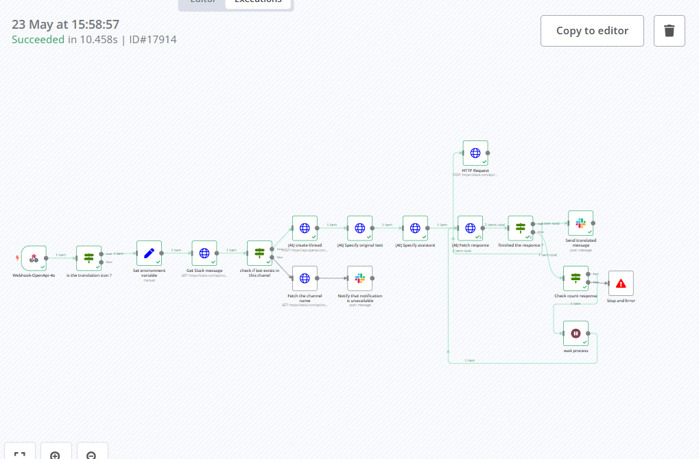
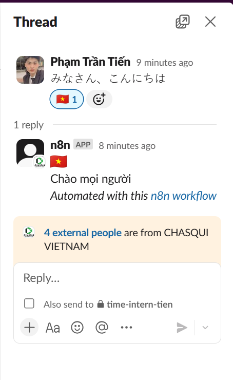
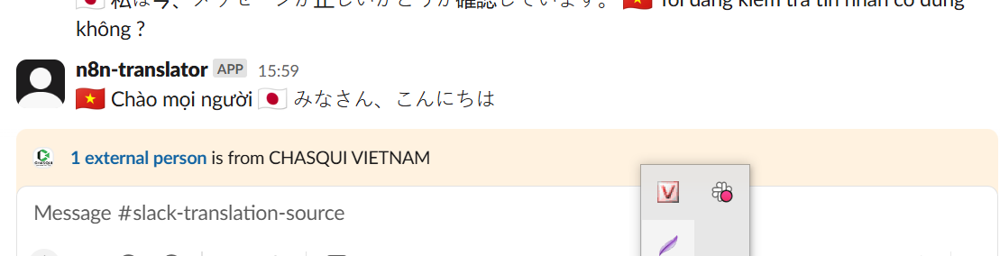

## 📅 Ngày: 23/05/2025
## 📘 Nội dung đã học:
Hôm nay tôi đã tìm hiểu và hoàn thiện một workflow dịch tin nhắn tiếng Nhật trong Slack bằng công cụ n8n, với mục tiêu:

Chỉ giữ lại bản dịch ngắn gọn trong kênh chính.

Chuyển bản gốc và bản dịch chi tiết vào một channel phụ để lưu trữ và tra cứu.

## 🔧 Chi tiết công việc:
Không tự thiết kế workflow từ đầu, mà chỉnh sửa workflow có sẵn do sếp cung cấp.

Thêm một số node mới để xử lý nội dung, định dạng lại tin nhắn, và tối ưu luồng gửi tin.

Tạo thêm một bot Slack mới để post tin nhắn dịch tự động.

Đảm bảo logic hoạt động đúng: khi người dùng thả emoji 🇯🇵 vào một tin nhắn Slack, bot sẽ:

Lấy nội dung gốc.

Dịch sang tiếng Việt (hoặc ngôn ngữ khác).

Gửi bản dịch ngắn vào kênh chính.

Gửi bản gốc + bản dịch chi tiết vào kênh phụ.

## 📝 Hình thức học:
Thực hành trên môi trường n8n thật, dựa trên cấu trúc workflow do sếp chuẩn bị.

Tìm hiểu từng node trong workflow có sẵn, chỉnh sửa lại câu lệnh, cấu trúc nội dung gửi đi.

Tham khảo hướng dẫn và trao đổi với ChatGPT để hiểu rõ hơn cách thức hoạt động của node HTTP, Slack API, và xử lý JSON.

## ✅ Kết quả & cảm nhận:
🎯 Workflow chạy đúng logic mong muốn, bot phản hồi nhanh, nội dung được xử lý gọn gàng.

✨ Rút kinh nghiệm về cách dùng biểu thức trong n8n để truy cập dữ liệu từ node khác.

🧠 Hiểu rõ hơn về vai trò của mỗi node: Trigger, HTTP, Slack API, Set/IF, Merge,...

🙌 Cảm thấy tự tin hơn trong việc duy trì hoặc mở rộng workflow đã có sẵn, phục vụ nhu cầu teamwork thực tế trong Slack.

📌 Đây là lần đầu tiên tôi tham gia chỉnh sửa workflow thực tế có bot Slack, và kết quả đạt được khiến tôi rất hào hứng học thêm về automation.

