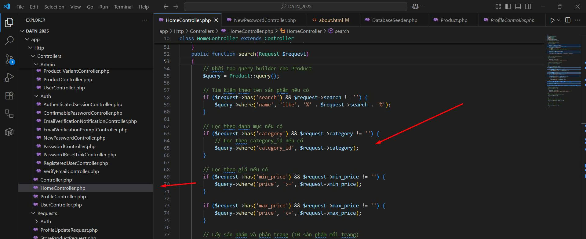
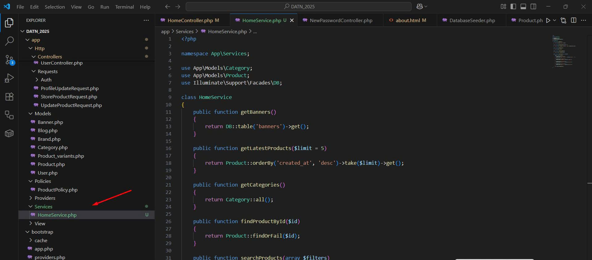

📅 Ngày: 25/06/2025
## 📘 Nội dung đã thực hiện:
Hôm nay tôi đã thực hành áp dụng các nguyên tắc trong SOLID vào dự án Laravel của mình để cải thiện kiến trúc và khả năng mở rộng của code.

## 📂 Các bước thực hiện:

Tạo thư mục Services để tách riêng phần logic nghiệp vụ khỏi Controller.

Viết class HomeService chịu trách nhiệm xử lý các tác vụ như lấy danh sách banner, sản phẩm, danh mục...

Thực hiện inject HomeService vào HomeController, giúp Controller chỉ đóng vai trò điều phối và gọi service – tuân theo nguyên tắc Single Responsibility (SRP).

Tách logic tìm kiếm sản phẩm theo nhiều filter sang Service, đảm bảo mở rộng thêm điều kiện tìm kiếm sau này mà không sửa code cũ (Open/Closed Principle - OCP).

Thể hiện rõ sự tách biệt giữa lớp điều phối và lớp xử lý logic – phù hợp với nguyên lý Dependency Inversion (DIP).

## ⚠️ Khó khăn gặp phải:
Vì lần đầu áp dụng SOLID trong Laravel nên mất thời gian để thiết kế lại cấu trúc code cho đúng nguyên lý.

Còn hơi bối rối khi quyết định nên đặt logic ở Service hay để lại trong Controller.

Phải refactor lại các hàm đã dùng trước đó để tách trách nhiệm rõ ràng hơn.

## ✅ Kết quả & đánh giá:
Đã áp dụng đúng các nguyên lý cơ bản như SRP, OCP, DIP.

Cấu trúc code rõ ràng hơn, dễ đọc và dễ mở rộng sau này.

Đây là bước khởi đầu quan trọng để tiến tới viết code chuyên nghiệp hơn trong Laravel.

