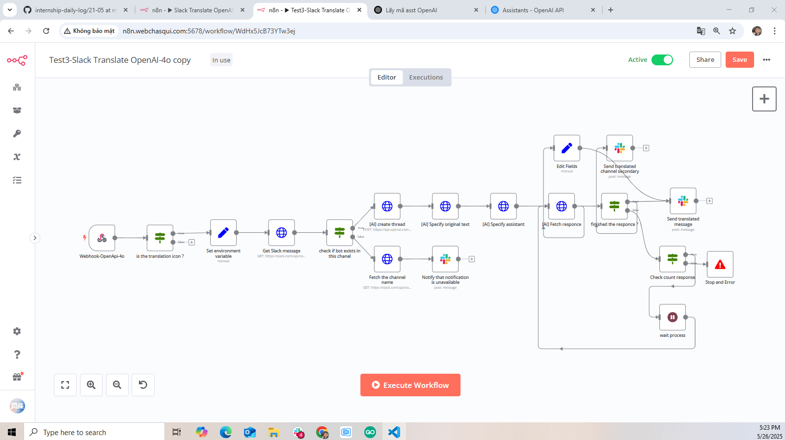

## 📅 Ngày: 26/05/2025
## 📘 Nội dung đã học:
Hôm nay tôi tiếp tục làm việc với workflow tự động dịch tin nhắn trong Slack bằng công cụ n8n, với trọng tâm là:

Hoàn thiện chức năng dịch ngắn gọn (summary translation) gửi vào kênh chính.

Tìm hiểu và xử lý vấn đề chạy các hàm (function) song song trong workflow — điều tôi chưa biết rõ trước đó.

## 🔧 Chi tiết công việc:
Dựa trên workflow cũ đã chỉnh sửa trước đó (từ ngày 23/05), tôi tiếp tục mở rộng thêm logic mới.

Triển khai thành công phần:

Dịch ngắn gọn nội dung và gửi vào kênh chính một cách rõ ràng, dễ đọc.

Gặp vướng mắc khi muốn xử lý nhiều khối logic cùng lúc (song song) như:

Gửi tin nhắn vào 2 kênh khác nhau cùng lúc.

Gọi 2 API khác nhau với dữ liệu chung.

## 🔍 Khó khăn: Không biết nên dùng node nào để "phân nhánh chạy song song" trong n8n. Đã thử IF, Merge, nhưng vẫn bị dính chuỗi xử lý theo thứ tự.

## ✅ Giải pháp tìm ra:
Sau nhiều lần thử và đọc tài liệu, tôi nhận ra có thể:

Dùng node NoOp hoặc Set để tách các nhánh riêng biệt.

Dùng node Merge (Mode: Pass-through) để gom kết quả lại nếu cần.

Hiểu rằng trong n8n, để chạy “song song” thì chỉ cần nối từ một node ra nhiều nhánh khác nhau, n8n sẽ xử lý độc lập, không cần chờ nhánh kia xong mới tới nhánh kế tiếp.

## 📝 Hình thức học:
Thực hành trên môi trường n8n thật.

Tự debug và thử nghiệm cách nối node để kiểm tra dòng dữ liệu.

Tra cứu tài liệu n8n và trao đổi với ChatGPT để hiểu rõ về cơ chế xử lý luồng song song.

## ✅ Kết quả & cảm nhận:
🎯 Workflow chạy đúng như mong muốn:

Tin nhắn dịch ngắn được gửi gọn gàng vào kênh chính.

Không còn bị “kẹt” ở một nhánh duy nhất khi cần xử lý nhiều việc cùng lúc.

✨ Học được cách điều khiển dòng dữ liệu và phân luồng xử lý trong n8n.
🧠 Hiểu rõ hơn về vai trò của các node như Set, NoOp, Merge, Function.
🙌 Cảm thấy hào hứng vì đã vượt qua một “chướng ngại” nhỏ nhưng quan trọng.
📌 Đây là bước tiến giúp tôi sẵn sàng mở rộng workflow thành nhiều luồng xử lý mạnh hơn trong tương lai.
