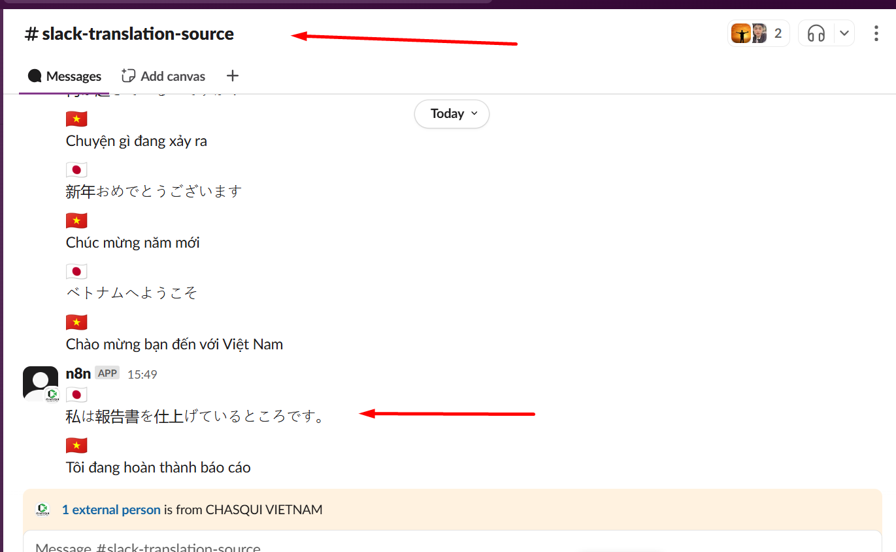
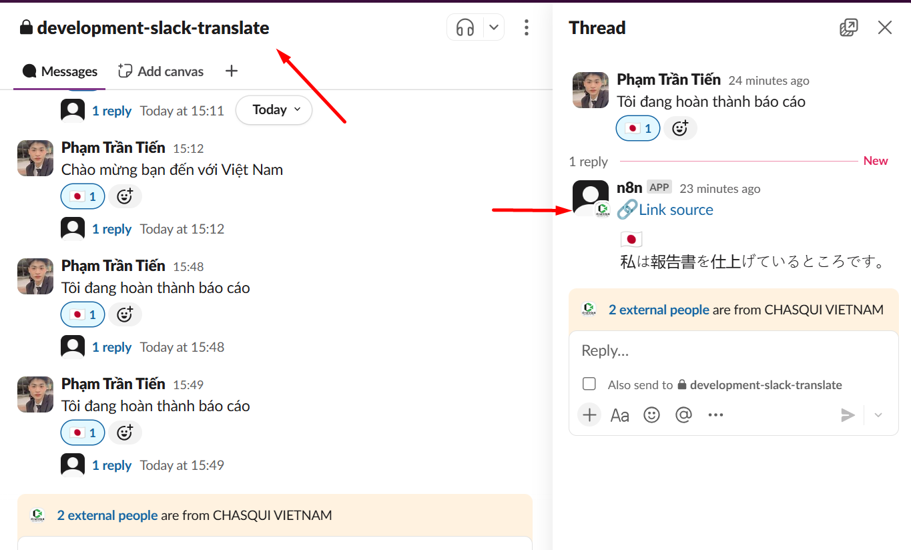

📅 Ngày: 27/05/2025
## 📘 Nội dung đã học:
Hôm nay tôi tiếp tục phát triển workflow dịch tin nhắn tự động trong Slack bằng n8n, với trọng tâm là:

Xử lý tạo liên kết (permalink) gắn liền với tin nhắn gốc.

Tối ưu hóa nội dung dịch: chỉ gửi bản dịch ngắn gọn vào kênh chính.

Lưu bản gốc + bản dịch vào kênh phụ để dễ dàng kiểm tra và truy xuất sau này.

## 🔧 Chi tiết công việc:
Dựa trên nền workflow đang có, tôi đã thực hiện các cập nhật sau:

Tách luồng dữ liệu:

Một luồng gửi bản dịch ngắn vào kênh chính.

Một luồng khác lưu bản dịch + bản gốc vào kênh phụ.

Xử lý timestamp:

Dùng .replace('.', '') để tạo liên kết đúng định dạng Slack permalink.

Tạo URL kiểu: https://slack.com/archives/[channel_id]/p[timestamp].

Định dạng nội dung gửi:

Dùng Markdown để tạo link ngắn gọn như:
<https://slack.com/archives/C08TSHE34CU/p1748332390040849|View full>

Kèm icon, bản dịch rõ ràng, ngắn gọn và dễ đọc.

🔍 Khó khăn:
Không biết rõ cách trích timestamp chuẩn để tạo permalink.

Cú pháp định dạng Slack link cần đúng tuyệt đối mới hoạt động được.

Thiếu kinh nghiệm về cách giữ luồng dữ liệu rõ ràng giữa hai kênh.

## ✅ Giải pháp tìm ra:
Hiểu rằng Slack permalink cần timestamp dạng p1234567890000000 (không có dấu chấm).

Sử dụng node Function hoặc Set để xử lý .ts.replace('.', '') trước khi tạo URL.

Tách luồng bằng cách kết nối node Function → 2 hướng khác nhau (song song).

Dùng logic "reaction added" để phản ứng lại khi có yêu cầu dịch.

## 📝 Hình thức học:
Tự thử nghiệm trực tiếp trong môi trường n8n thật.

Gửi test vào Slack để xác nhận hiển thị đúng.

Tra cứu tài liệu Slack & tham khảo với ChatGPT để hiểu rõ hơn.

## ✅ Kết quả & cảm nhận:
## 🎯 Workflow xử lý đúng như mong đợi:

Gửi bản dịch ngắn vào kênh chính một cách gọn gàng.

Lưu bản dịch + bản gốc vào kênh phụ, kèm link truy xuất lại bản gốc dễ dàng.

Định dạng hiển thị thân thiện và ngắn gọn hơn trước.

✨ Học thêm được kỹ thuật xử lý dữ liệu dạng link động với timestamp.
🧠 Củng cố kiến thức về flow song song và cấu trúc Slack Markdown.
🙌 Cảm thấy tự tin hơn trong việc mở rộng các chức năng nâng cao sau này.

