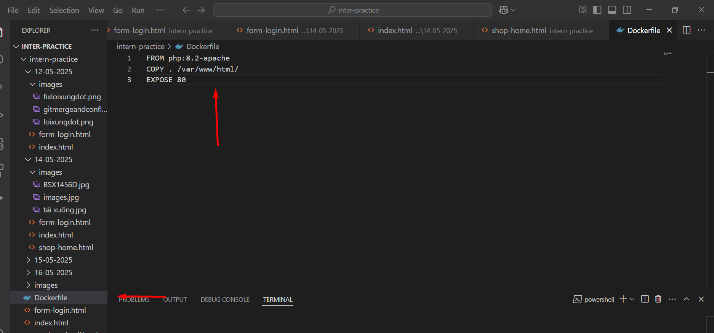
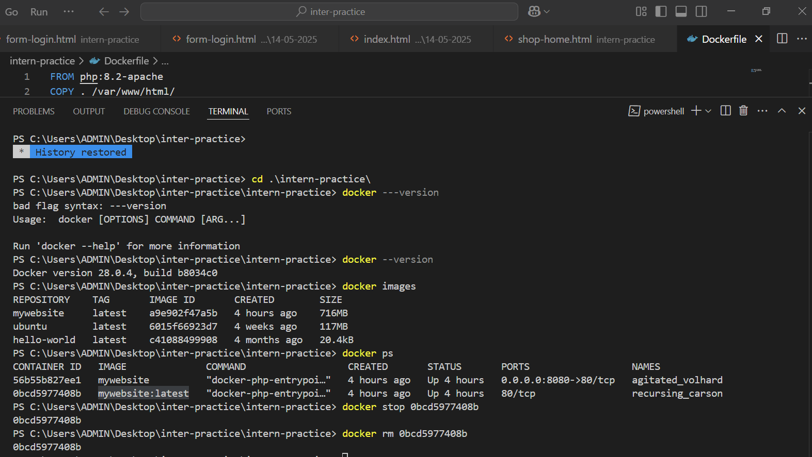

📅 Ngày: 28/05/2025

## 📘 Nội dung đã học:
Hôm nay tôi tiếp tục làm việc với Docker, cụ thể là xây dựng Dockerfile và chạy container. Các công việc chính bao gồm:

## Tạo Dockerfile cho một dự án với Apache và PHP.

Sử dụng lệnh docker images để kiểm tra các image đã được tạo ra.

Tiến hành chạy Docker container từ một image đã xây dựng.

Kiểm tra và xóa các container đã dừng sử dụng với lệnh docker ps, docker stop, và docker rm.

🔧 Chi tiết công việc:
## Tạo Dockerfile:

Đã tạo một Dockerfile với các chỉ thị FROM php:8.2-apache, COPY ./ /var/www/html/ và EXPOSE 80 để cấu hình môi trường Apache và PHP cho dự án.

Xây dựng Docker image:

Đã thực hiện lệnh docker build -t mywebsite . để xây dựng Docker image từ Dockerfile.

Đã xác nhận Docker image được tạo thành công với lệnh docker images.

Chạy container:

Đã chạy Docker container từ image vừa tạo với lệnh docker run -d -p 8080:80 mywebsite.

Container được chạy thành công và có thể truy cập qua địa chỉ localhost:8080.

Quản lý container:

Đã sử dụng lệnh docker ps để kiểm tra trạng thái container đang chạy.

Đã sử dụng lệnh docker stop và docker rm để dừng và xóa container không cần thiết.

## 🔍 Khó khăn:
Lỗi khi sử dụng lệnh docker --version, cần điều chỉnh cú pháp đúng.

Quản lý các container và image Docker có thể gặp chút phức tạp khi có nhiều container đang chạy cùng lúc.

✅ Giải pháp tìm ra:
Điều chỉnh cú pháp của lệnh Docker, sử dụng đúng phiên bản và lệnh.

Sử dụng docker ps để kiểm tra trạng thái của các container và loại bỏ những container không còn sử dụng.

## 📝 Hình thức học:
Học qua thực hành trực tiếp trên môi trường Docker.

Đọc tài liệu Docker chính thức và tham khảo các ví dụ từ cộng đồng.

## ✅ Kết quả & cảm nhận:
Thành công trong việc tạo Dockerfile và chạy container từ Docker image.

Đã nắm bắt được cách sử dụng Docker để phát triển và triển khai ứng dụng dễ dàng hơn.   

