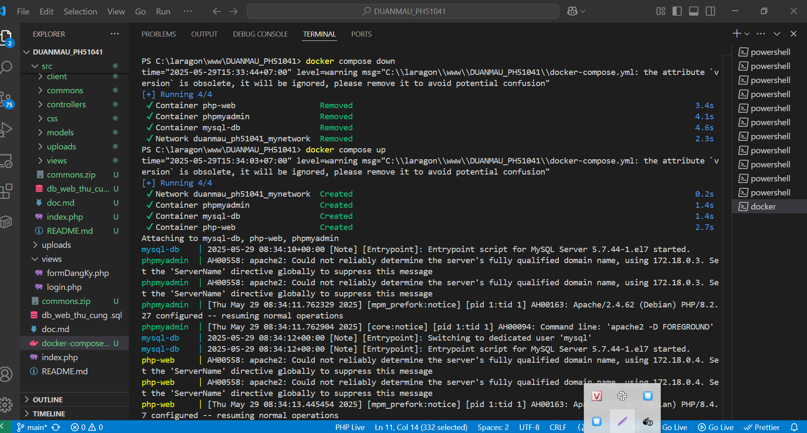
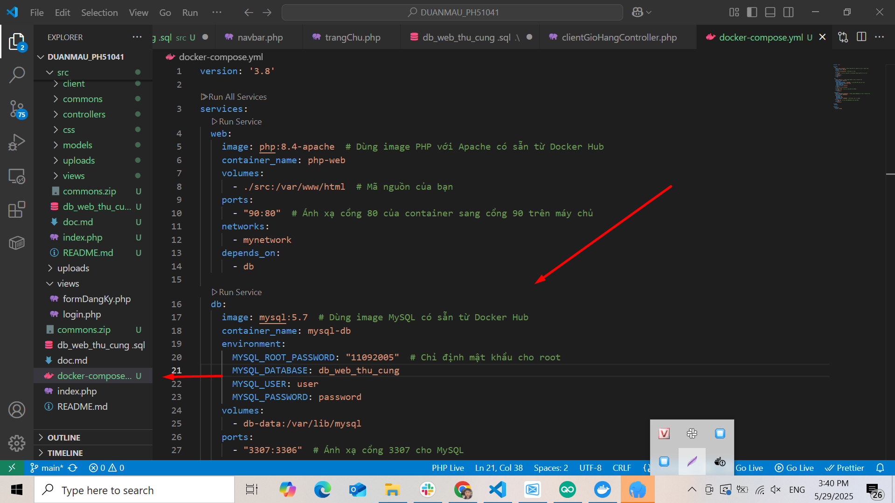
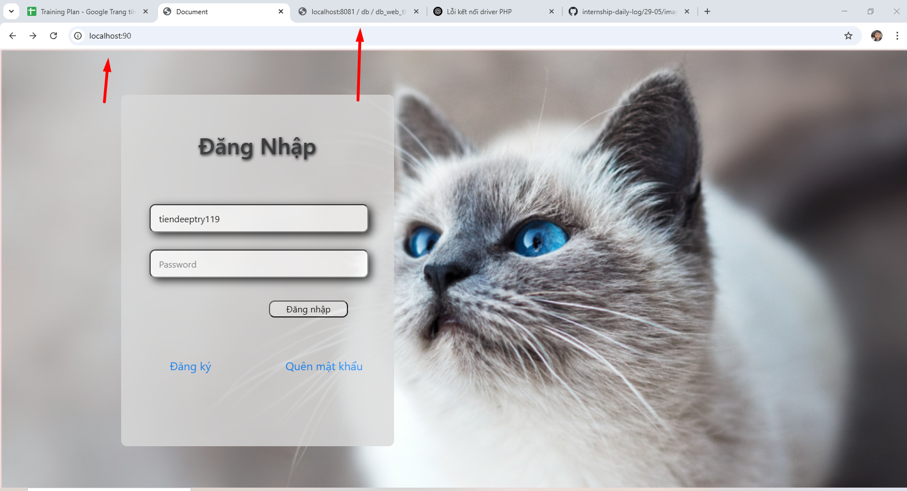

## 📅 Ngày: 29/05/2025

## 📘 Nội dung đã học:
Hôm nay tôi tiếp tục làm việc với Docker và PHP, chủ yếu là giải quyết các vấn đề liên quan đến Dockerfile và Docker Compose, cùng với kết nối MySQL giữa Docker và phpMyAdmin.

Hiểu rõ sự khác biệt giữa Dockerfile và Docker Compose.

Xử lý kết nối MySQL giữa Docker và phpMyAdmin.

Khắc phục các vấn đề phát sinh khi sử dụng Docker với PHP và MySQL.

## 🔧 Chi tiết công việc:
Dockerfile và Docker Compose:
Dockerfile dùng để tạo Docker image từ đầu, còn Docker Compose dùng để quản lý nhiều container và kết nối chúng lại với nhau trong một dự án.

Kết nối MySQL trong Docker:
Đã sử dụng Docker Compose để kết nối PHP với MySQL trong container.

MySQL chạy trong container và có thể quản lý qua phpMyAdmin.

Cập nhật Docker Compose:
Cập nhật docker-compose.yml để kết nối PHP và MySQL trong Docker, đồng thời cài đặt phpMyAdmin để quản lý cơ sở dữ liệu.

Khắc phục lỗi kết nối MySQL:
Đã cài đặt PDO MySQL và MySQLi vào PHP container để giải quyết lỗi "could not find driver".

Khắc phục lỗi collation:
Lỗi utf8mb4_0900_ai_ci không tương thích với MySQL 5.7 đã được khắc phục bằng cách thay đổi collation trong tệp SQL.

Import dữ liệu vào MySQL:
Sau khi import dữ liệu vào MySQL từ phpMyAdmin của máy chính, đã xác nhận dữ liệu được hiển thị đúng trong phpMyAdmin trên localhost.

## 🔍 Khó khăn:
Lỗi collation và vấn đề kết nối MySQL giữa Docker và phpMyAdmin.
Không hiểu sự khác nhau giữa dockerfile và dockercompose ở đâu

## ✅ Giải pháp tìm ra:
Sửa tệp SQL để thay thế collation utf8mb4_0900_ai_ci bằng utf8mb4_unicode_ci.

Cài đặt các extension PDO MySQL và MySQLi để giải quyết vấn đề kết nối cơ sở dữ liệu.

## 📝 Hình thức học:
Học qua thực hành trực tiếp trên Docker.

Đọc tài liệu Docker và tham khảo các ví dụ từ cộng đồng.

## ✅ Kết quả & cảm nhận:
Hiểu rõ cách sử dụng Docker Compose để kết nối các dịch vụ trong Docker.

Khắc phục thành công các lỗi kết nối MySQL và collation trong quá trình làm việc với Docker và PHP.

Đã nắm bắt được sự khác biệt giữa Dockerfile và Docker Compose và cách sử dụng chúng .

