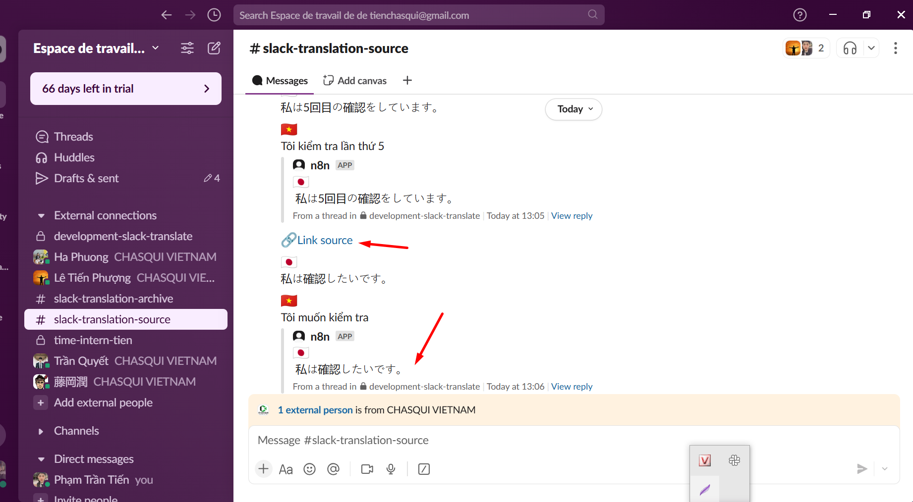

## 📅 Ngày: 30/05/2025
## 📘 Nội dung đã học:
Hôm nay tôi tiếp tục làm việc với n8n để cập nhật luồng workflow xử lý tin nhắn Slack có gắn emoji dịch. Chủ yếu tập trung vào xử lý yêu cầu mới từ sếp liên quan đến việc gửi link trong phần Archive của tin nhắn gốc, không đính kèm trong phần dịch như trước.

## 🔧 Chi tiết công việc:
Yêu cầu mới từ sếp:

Link của tin nhắn gốc (tin nhắn chứa emoji dịch) phải nằm trong phần Archive (tin nhắn cha).

Không chèn link vào phần dịch (tin nhắn con) để đảm bảo tin nhắn dịch gửi nhanh hơn.

Vấn đề gặp phải:

Workflow ban đầu chỉ chèn link vào tin nhắn con (tin nhắn chứa bản dịch).

Không tìm ra cách cập nhật link trong tin nhắn cha khi phản ứng emoji xảy ra trên tin nhắn con.

Giải pháp & cập nhật:

Đối chiếu message_ts giữa tin nhắn gốc và tin nhắn con trên Slack để truy xuất đúng link.

Sử dụng node Slack API trong n8n để cập nhật lại nội dung tin nhắn cha, chèn thêm link archive vào đó.

Đảm bảo tin nhắn con (dịch) vẫn gửi nhanh, không bị delay do xử lý link.

Kiểm tra thực tế trên kênh Slack #archive đã cho kết quả như yêu cầu:

Tin nhắn dịch xuất hiện nhanh.

Tin nhắn cha chứa link chính xác đến bản gốc.

## 🔍 Khó khăn:
Không thể chèn link vào tin nhắn cha khi chỉ có message_ts của tin nhắn con.

Mất thời gian xác định cách xác minh quan hệ giữa các tin nhắn trong Slack (cha – con).

Cần đồng bộ thời điểm gửi tin nhắn để tránh xung đột nội dung khi cập nhật lại.

## ✅ Giải pháp tìm ra:
Đối chiếu thread_ts và ts để xác định đúng cha – con trong Slack.

Dùng Slack API method chat.update để chỉnh sửa nội dung tin nhắn gốc và chèn link vào cuối.

Workflow n8n được chỉnh sửa để có 2 nhánh xử lý:

Một nhánh gửi tin nhắn dịch (nhanh).

Một nhánh cập nhật tin nhắn cha để chèn link (có thể delay nhẹ).

## 📝 Hình thức học:
Thực hành trực tiếp trên n8n với Slack API.

Đọc tài liệu n8n và Slack API (đặc biệt là chat.postMessage, chat.update).

Kiểm tra các phản hồi trực tiếp từ Slack workspace thật.

## ✅ Kết quả & cảm nhận:
Đã xử lý yêu cầu cập nhật link vào tin nhắn Archive đúng như mong muốn của sếp.

Tin nhắn dịch gửi nhanh, không bị ảnh hưởng bởi cập nhật link.

Hiểu sâu hơn cách hoạt động của Slack thread, ts, thread_ts.

Workflow trên n8n hoạt động ổn định, có thể mở rộng cho các ngôn ngữ dịch khác

